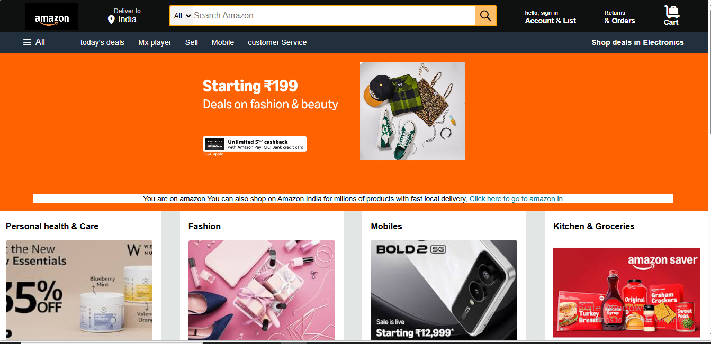

#  Amazon Clone UI

🚀 A fully responsive Amazon Clone homepage built using HTML and CSS.  
This project focuses on mastering frontend fundamentals and creating a real-world e-commerce UI.

## ✨ Features

- 🔍 Navigation bar with search functionality  
- 🛍️ Product sections (Fashion, Mobiles, Furniture, etc.)  
- 🎯 Clean and structured layout  
- 📱 Fully responsive design  
- 🧩 Card-based UI like real Amazon  
- 📌 Footer similar to production websites  

---

## 🛠️ Tech Stack

- HTML5  
- CSS3 (Flexbox & Grid)

---

## 📸 Screenshots

## 📸 Screenshots

---

## 📚 What I Learned

- How to build real-world UI from scratch  
- Improving layout design using Flexbox & Grid  
- Fixing spacing and alignment issues  
- Writing clean and maintainable code  

---

## 🚧 Future Improvements

- Add backend functionality (Node.js / Database)  
- Make it a full-stack e-commerce website  
- Add user authentication & cart system  

---

## 🙋‍♂️ Author

**Lavkush Shukla**  
B.Tech CSE(AIML) Student  

---

## ⭐ Support

If you like this project, please give it a ⭐ on GitHub!
